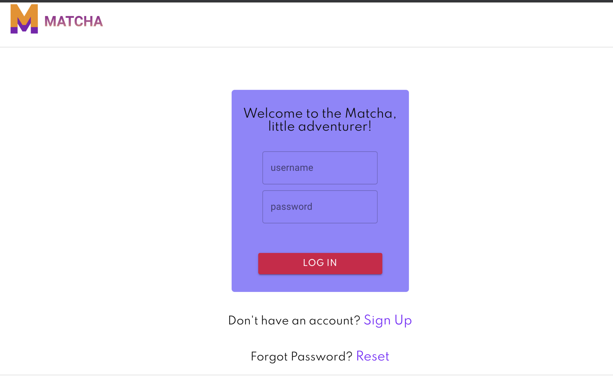
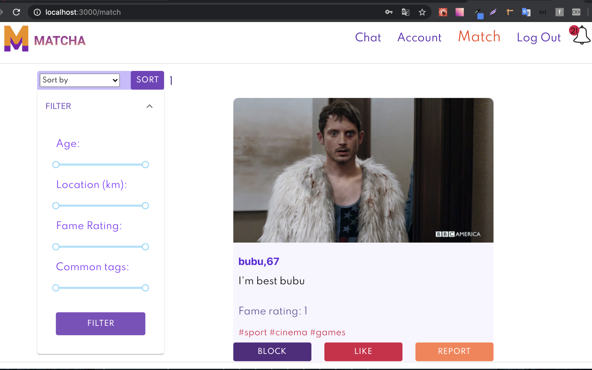
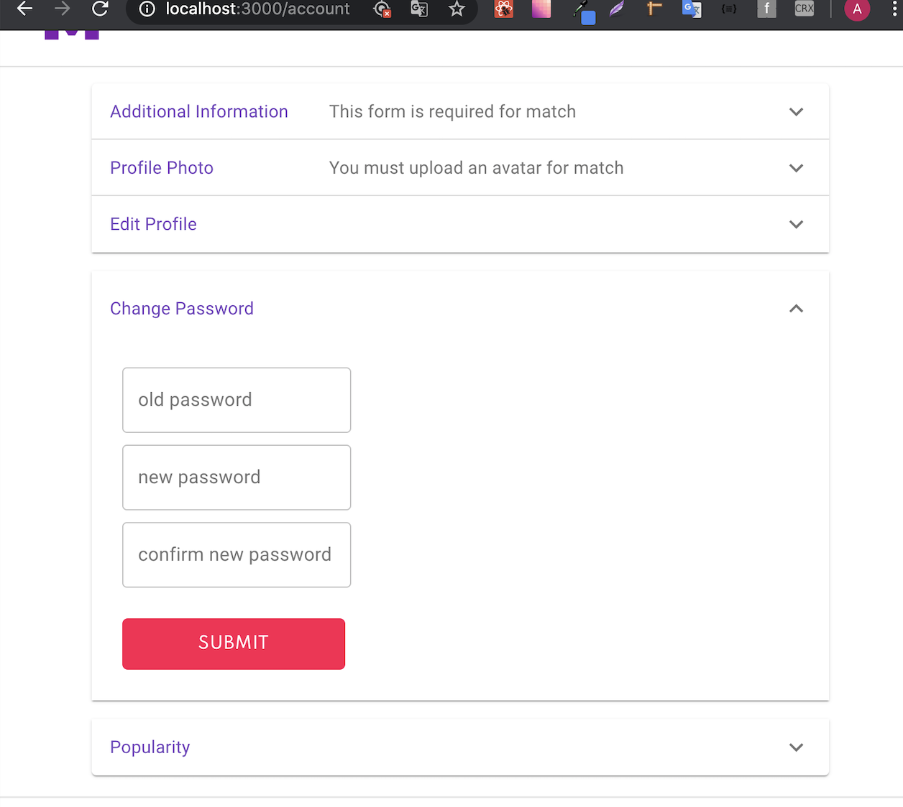
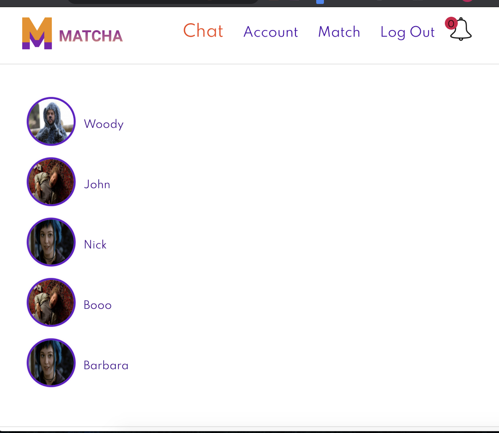
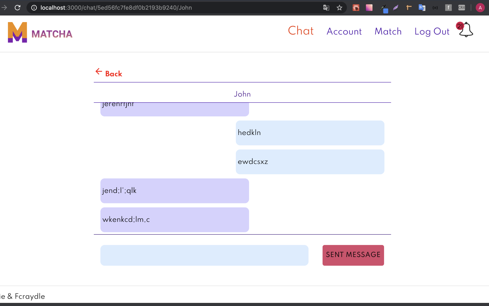
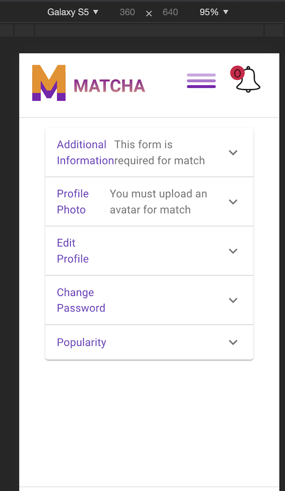
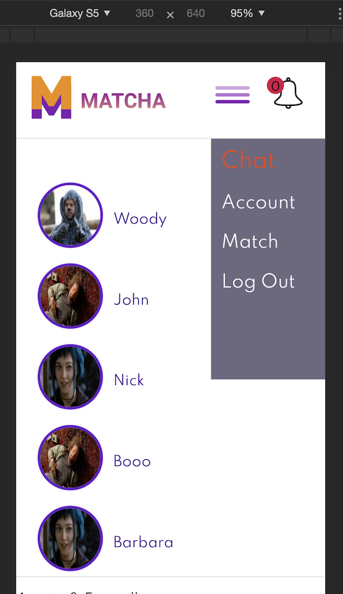

# Matcha
[42 Project] - Second project of the web branch

## Project description
*Dating web application. In the application, you can register and get a list of users most suitable for the selected parameters (distance by geo, age and tags). In the application, you can choose your location on the map (google map), you can put like / dislike or block the user. There is also a chat where can correspond in real time (socket).*

## Stack
* React.js
* Redax
* MongoDB
* Express.js

## Screenshots

